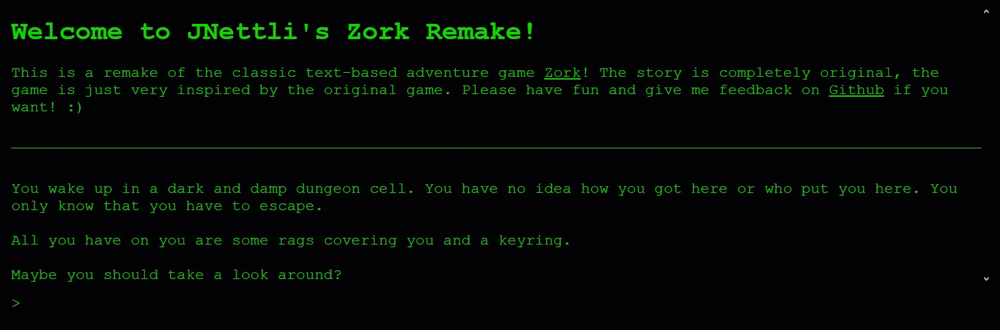

# Zork Remake

## Description:
Zork Remake is a remake of the classic game [Zork](https://en.wikipedia.org/wiki/Zork)! It is a text-based adventure game with the classic "Matrix" look of old-school computers with a brand new story and functionality. Implemented with HTML, CSS and most importantly, Javascript, the game allows you to use text commands to walk around, look at the environment and go on an amazing adventure!

I used the base found [here](https://dev.to/shawn2208/building-a-mini-text-based-adventure-game-mini-zork-with-html-css-js-3879) and built on it with a different room layout, items, look, etc.

## Screenshot: 
<div style="display: flex; flex-direction: row;">
  <a href="assets/readme/screenshot.jpg">
    
  </a>
</div>

## Technologies Used:
- HTML
- Javascript
- CSS
- Figma (to plan room-layout)

## Installation

Click [here](https://jnettli-zork-remake.netlify.app/) to start playing!


## How to play
Some commands to help you start your journey
```

help
// This will show more commands to use.

look
// You will take a look around the area you are currently in. Use this often!

```

## Contributing: 
This project is not open for direct contributions, but is available for forking.

## Known Issues
- The game is not finished

## License

[MIT](https://choosealicense.com/licenses/mit/)
